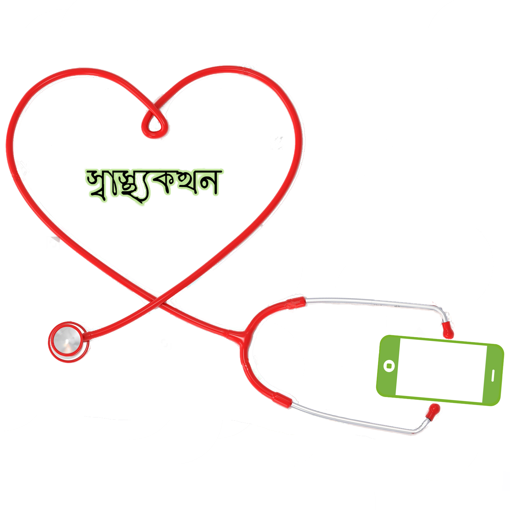

# Shasthokothon(স্বাস্থ্যকথন)

Shasthokothon  is an android application.Basically it is health related.The design goal was creating app that can provide information and that can be a companion of our busy life.Roughly the features of the app can be divided into two catagories informative and service.Obviously the  i use  java for app design and Firebase for cloud storage. The front end is designed in Bengali language.

## Features of Shasthokothon
### First Aid
The app features 13 common first aid solutions with do and dont's.The first Aid solutions are explained in easier way so that common people can follow the instructions.
### Common Tests 
In this feature we have 3 common health related tests.
- Autism Test: In this feature we have a questionnaire.By answering this questionnaire(yes/no) user can find his/her child is autistic or not(Disclaimer:The test never say  anyone is autistic rather than if the result is positive it says the child may have autism problem and it will be good if you contact your doctor).The app does not store or share test related data.
- BMI Test:BMI(Body Mass Index) test is test by which one can know is his/her weight is normal according to his/her height.The features uses body mass formula.
- Color Blindness Test: The app uses ishihara test to determine color blindness.In this feature user will find 15 slides with something writtenand user will be asked to unput what he finds in the slides.Based on the user reply color blindness detected.
### Vaccine Reminder
In this feature user will provide birthday of his/her child.Based on this information the app will notify when to vaccinate his/her child(The app never share this information)
### Emergency Contact
This feature has 2 sub features.
- Hospital's Position in Map:Bades on user's current position the app will show nearby hospitals in google mapwith address.This feature requires GPS and internet.
- Emergency Contact List:In this feature user will find Hsopital,Blood Bank,Ambulance's contact information .User has to select division(8 Divisions of Bangladesh) and he/she will find information of thar division.
### Medicine Reminder
By using this feature user will get notification when he/she has to take medicine.To use this feature first he/she has to provide information about quantity ,time and duration of medication.After that he/she will recieve notification with quantity through the whole duration.
### Drug Reaction
This feature has 2 sub feature
- Medication result:In this feature user can anonymously provide feedback about a medicine wheather the medicine works in proper way or he suffered from any type of reaction.The feedback will be stored in cloud.
-FeedBack: In this feature user can search about reaction of a specific medicine .If cloud storage has any information abot that medicine  it will be shown in a graph form.

The app was designed for EATL Prothom-Alo App Contest 2016 and it was one of the top 10 apps among 500 cool apps.

